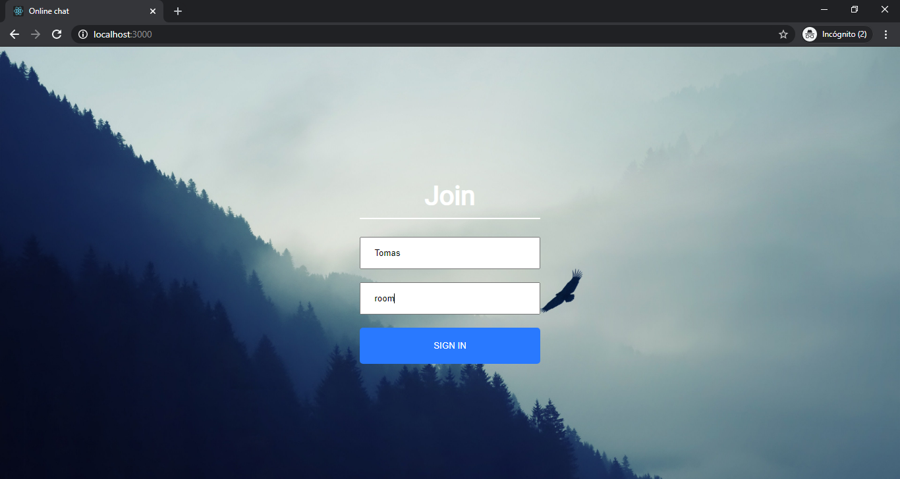
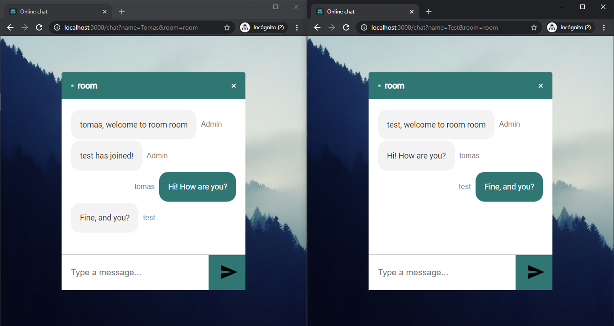
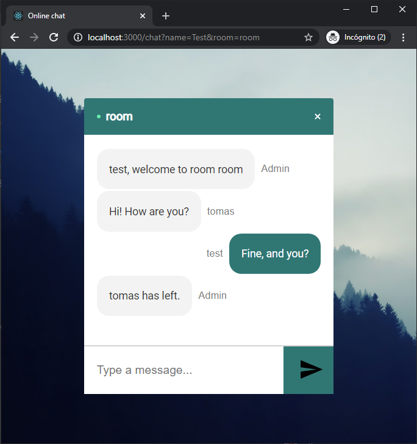

# Real Time Chat APP

### Stack of technologies:

- Front End:
    + HTML - CSS - Javascript
    + React

- Back End:
    + Node.js
    + Express
    
- For make instant messaging chat:
    + Socket.IO

# How to start the project:

If you want to see the page for yourself, you'll need to do the following:

- run npm i && npm start for both client and server side to start the development server

# Previews

### Home page:

### Chat:

Enjoy !
